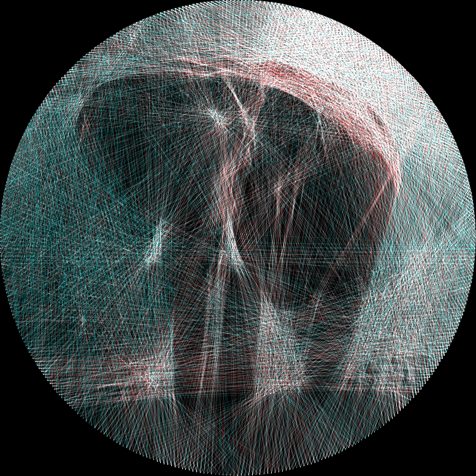
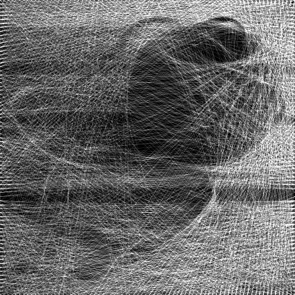
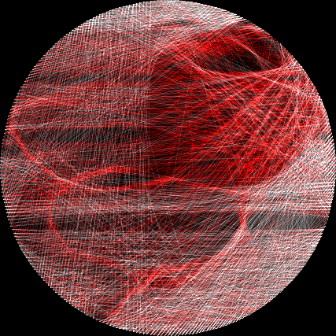

<p align="center">
  
</p>

# string_art

> Transform an image into string art

## Installation

```bash
git clone https://github.com/spejamchr/string_art
cd string_art
cargo build --release
```

The binary will be at `./target/release/string_art`.

## Usage

```bash
string_art --input-filepath <FILEPATH> --output-filepath <FILEPATH> [FLAGS] [OPTIONS]
```

Use `--help` or `-h` to see the full usage.

## Examples

### Grayscale: White String on Black Background

<p align="center">
  
  
</p>

```bash
string_art \
    --input-filepath ./examples/fiber.jpg \
    --output-filepath ./examples/fiber-string-wob.png \
    --data-filepath ./examples/fiber-string-wob.json \
    --pin-arrangement perimeter \
    --pin-count 300 \
    --step-size 0.5 \
    --string-alpha 0.1 \
    --max-strings 2300 \
    --verbose --verbose
```

### Splash of Color: White & Red String on Black Background

This also uses the `--gif-filepath` options to create a GIF of the creation process.

<p align="center">
  
  
  
</p>

```bash
string_art \
    --input-filepath ./examples/fiber.jpg \
    --output-filepath ./examples/fiber-string-color.png \
    --data-filepath ./examples/fiber-string-color.json \
    --gif-filepath ./examples/fiber-string-color.gif \
    --pin-arrangement circle \
    --pin-count 300 \
    --step-size 0.5 \
    --string-alpha 0.1 \
    --foreground-color '#FFFFFF' \
    --foreground-color '#FF0000' \
    --max-strings 2600 \
    --verbose --verbose
```

### The Elephant: Auto-pick the colors

```bash
./target/release/string_art \
    --input-filepath ./examples/elephant.jpg \
    --output-filepath ./examples/elephant.png \
    --data-filepath ./examples/elephant.json \
    --pin-arrangement circle \
    --pin-count 400 \
    --step-size 0.5 \
    --string-alpha 0.1 \
    -u 3 \
    --verbose --verbose
```
